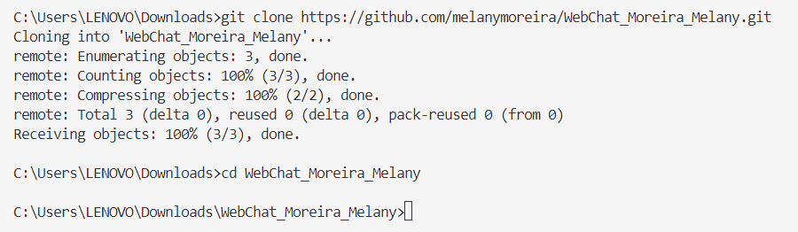
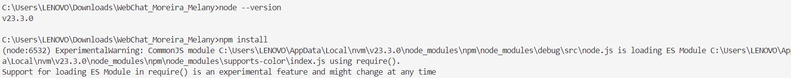
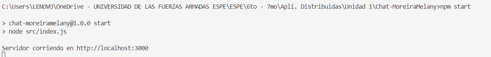
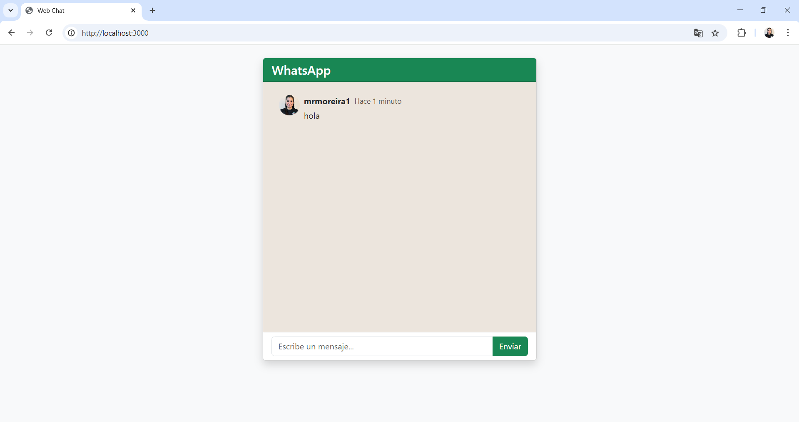
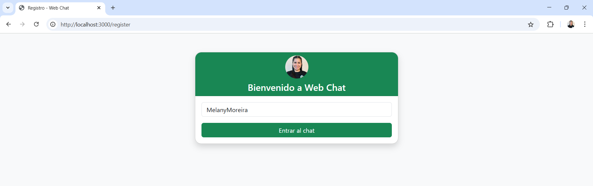
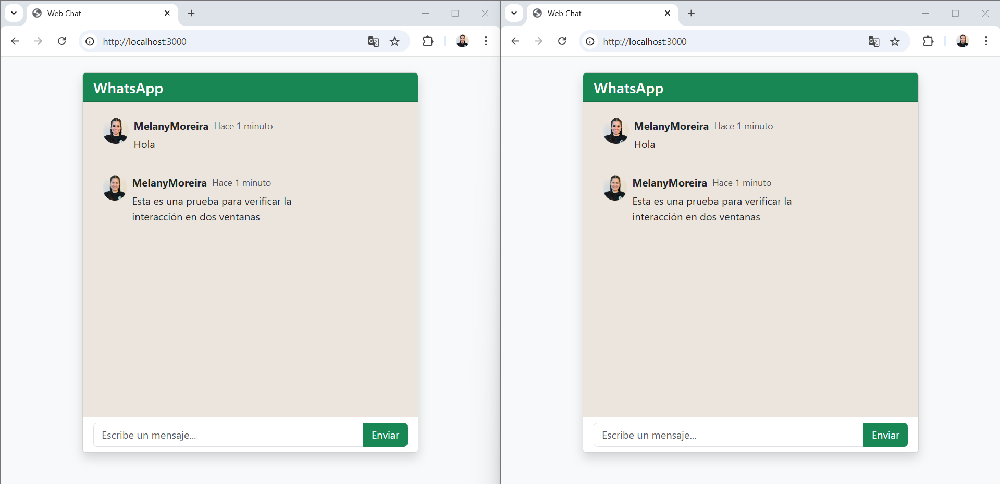

# Chat en Tiempo Real con Sockets

**Estudiante:** Melany Rosmery Moreira Zambrano  
**Fecha de entrega:** 30 mayo de 2025

---

## Introducción

Este proyecto consiste en el desarrollo de una aplicación web de chat en tiempo real, utilizando tecnologías modernas como **Node.js**, **Express**, **Socket.io** y **Bootstrap**. El objetivo principal es demostrar cómo los sockets permiten la comunicación instantánea entre usuarios, una característica esencial en aplicaciones como chats, juegos en línea y sistemas de notificaciones.

El uso de sockets es fundamental para lograr una experiencia fluida y dinámica, ya que permite que los mensajes se transmitan y reciban al instante, sin necesidad de recargar la página. Este proyecto busca no solo implementar la funcionalidad básica de un chat, sino también mejorar la experiencia del usuario con un diseño atractivo, responsivo y características adicionales como el uso de emojis y notificaciones.

---

## Repositorio Base

Todo el código fuente y la documentación de este proyecto se encuentran en el siguiente repositorio de GitHub:  
[https://github.com/melanymoreira/WebChat-MelanyMoreira.git](https://github.com/melanymoreira/WebChat-MelanyMoreira.git)

---

## Implementación del Proyecto

### Estructura del Código

El proyecto está organizado de la siguiente manera para mantener una separación clara entre la lógica del servidor, la interfaz de usuario y los recursos estáticos:

```
src/
  public/
    js/
      register.js      # Lógica para el registro de usuario
      script.js        # Lógica principal del chat y emojis
    css/
      style.css        # Estilos personalizados para el chat
    img/
      Foto.jpg         # Imagen de perfil por defecto
  views/
    index.html         # Interfaz principal del chat
    register.html      # Formulario de registro de usuario
  routes/
    index.js           # Rutas principales de Express
  index.js             # Servidor principal Express
  realTimeServer.js    # Lógica de Socket.io
package.json
README.md
```

- **index.js:** Configura el servidor Express, las rutas para servir los archivos HTML y los recursos estáticos, y conecta con Socket.io.
- **realTimeServer.js:** Maneja la lógica de Socket.io para recibir y emitir mensajes en tiempo real entre los clientes.
- **views/index.html:** Interfaz principal del chat, con diseño tipo WhatsApp, campo de mensajes, botón de enviar.
- **views/register.html:** Formulario de registro para ingresar el nombre de usuario antes de acceder al chat.
- **public/js/script.js:** Lógica del chat: conexión a Socket.io, envío y recepción de mensajes.
- **public/js/register.js:** Lógica para guardar el nombre de usuario en una cookie y redirigir al chat.
- **public/css/style.css:** Estilos personalizados para mejorar la apariencia tipo WhatsApp.

### Mejoras Realizadas al Diseño del Chat

- **Framework Bootstrap:** Se utilizó Bootstrap 5 para lograr un diseño moderno, limpio y responsivo, facilitando la adaptación a dispositivos móviles y de escritorio.
- **Interfaz tipo WhatsApp:** Se replicó la estructura visual de WhatsApp, con colores suaves y una experiencia de usuario familiar.
- **Colores y tipografía:** Se eligieron colores agradables y tipografía clara para mejorar la legibilidad y la estética general guíandonos en WhatsApp.
- **Espaciado y organización:** Se mejoró el espaciado entre elementos y la organización visual del chat para una experiencia más cómoda.
- **Diseño responsivo:** El chat se adapta automáticamente a diferentes tamaños de pantalla, permitiendo su uso en computadoras, tablets y smartphones.

### Características Adicionales

- **Nombre de Usuario:** Antes de ingresar al chat, el usuario debe registrarse con un nombre, lo que personaliza la experiencia y permite identificar a cada participante.
- **Foto de usuario:** Se muestra una imagen de perfil junto al nombre en cada mensaje, mejorando la identificación visual de los participantes.

---

## Instrucciones de Ejecución

Sigue estos pasos detallados para ejecutar el proyecto localmente en tu computadora:

### 1. Clona el repositorio

Abre una terminal y ejecuta:

```bash
git clone https://github.com/melanymoreira/WebChat-MelanyMoreira.git
cd WebChat_Moreira_Melany
```


Esto descargará todo el código fuente en tu máquina.

### 2. Instala las dependencias

Asegúrate de tener [Node.js](https://nodejs.org/) instalado. Luego ejecuta:

```bash
npm install
```


Este comando instalará todas las dependencias necesarias, como Express, Socket.io, Bootstrap y otras librerías utilizadas en el proyecto.

### 3. Inicia el servidor

Para arrancar la aplicación, ejecuta:

```bash
npm start
```


El servidor se iniciará en el puerto 3000 por defecto. Si deseas cambiar el puerto, puedes modificar la variable de entorno `PORT` o el valor en el archivo `index.js`.

### 4. Accede a la aplicación

Abre tu navegador web favorito y entra a:

```
http://localhost:3000
```


### 5. Uso de la aplicación

- **Registro:** Al ingresar, verás el formulario de registro. Escribe tu nombre de usuario y haz clic en "Entrar al chat".
- **Chat:** Accederás a la sala de chat, donde podrás enviar mensajes, usar emojis (botón 😊) y recibir notificaciones de nuevos mensajes.
- **Emojis:** Haz clic en el botón de emoji para abrir el selector y elige el emoji que desees insertar en tu mensaje.
- **Notificaciones:** Si tienes la pestaña en segundo plano y alguien envía un mensaje, recibirás una notificación en tu escritorio.
- **Cambiar usuario:** Si deseas cambiar de usuario, borra la cookie `username` desde las herramientas de desarrollador del navegador y recarga la página.

---

## Capturas de Pantalla

### Registro de Usuario


### Chat en Tiempo Real


---

## Conclusiones

Durante el desarrollo de este proyecto aprendí la importancia de los sockets para la comunicación en tiempo real, así como la integración de tecnologías modernas como Bootstrap para mejorar la experiencia del usuario.  
Una de las principales dificultades fue la gestión de rutas y recursos estáticos en Express, especialmente al separar los archivos HTML en la carpeta `views` y los recursos en `public`. Esto se solucionó configurando correctamente las rutas en el servidor y utilizando middlewares para validar el acceso de los usuarios.  
También fue un reto lograr un diseño responsivo y atractivo, pero el uso de Bootstrap facilitó este proceso.  
Este proyecto me permitió consolidar conocimientos sobre Node.js, Express, Socket.io y buenas prácticas de desarrollo web con el buen uso de la distribución de archivos.

---

## Referencias

- [Socket.io Documentation](https://socket.io/docs/)
- [Bootstrap 5 Documentation](https://getbootstrap.com/docs/5.3/getting-started/introduction/)
- [MDN Web Docs - Cookies](https://developer.mozilla.org/en-US/docs/Web/API/Document/cookie)
- [Express.js Documentation](https://expressjs.com/)

---

> **Repositorio:** [https://github.com/melanymoreira/WebChat-MelanyMoreira.git](https://github.com/melanymoreira/WebChat-MelanyMoreira.git)