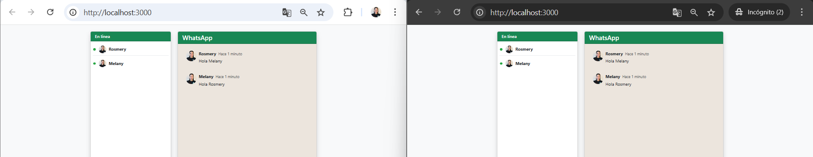

# Chat en Tiempo Real con Sockets

**Estudiante:** Melany Rosmery Moreira Zambrano  
**Fecha de entrega:** 30 mayo de 2025

---

## Introducción

El objetivo principal de este laboratorio es implementar una sección que muestre la lista de usuarios conectados en tiempo real, similar al diseño de aplicaciones como WhatsApp. Esta funcionalidad permite a los participantes visualizar quiénes están activos en el chat en todo momento, mejorando la interacción y la experiencia de usuario dentro de la aplicación.  
El desarrollo se realizó utilizando *Node.js*, *Express*, *Socket.io* y *Bootstrap*, enfocando todos los esfuerzos en lograr una visualización clara, dinámica y atractiva de los usuarios conectados.

---

## Repositorio Base

Todo el código fuente y la documentación de este proyecto se encuentran en el siguiente repositorio de GitHub:  
[https://github.com/melanymoreira/WebChat-MelanyMoreira.git](https://github.com/melanymoreira/WebChat-MelanyMoreira.git)

---

## Estructura del Proyecto

```
WebChat-MelanyMoreira/
│
├── src/
│   ├── index.js                # Servidor principal Express
│   ├── realTimeServer.js       # Lógica de Socket.io
│   ├── usersSocket.js          # Gestión de usuarios conectados
│   ├── middlewares/
│   │   └── isLoggedIn.js       # Middleware para validar acceso
│   ├── routes/
│   │   └── index.js            # Rutas principales de Express
│   ├── views/
│   │   ├── index.html          # Interfaz principal del chat
│   │   └── register.html       # Formulario de registro de usuario
│   └── public/
│       ├── js/
│       │   ├── register.js     # Lógica para el registro de usuario
│       │   └── script.js       # Lógica principal del chat y usuarios conectados
│       ├── css/
│       │   └── style.css       # Estilos personalizados para el chat
│       └── img/
│           ├── Foto.jpg        # Imagen de perfil por defecto
│           ├── Registro-Usuario.png
│           ├── Chat-TiempoReal.png
│           └── Usuarios-Conectados.png
├── package.json
└── README.md
```

---

## Mejoras Realizadas al Diseño del Chat

- **Lista de usuarios conectados en tiempo real:** Se implementó una sección dedicada que muestra dinámicamente los usuarios conectados, permitiendo ver quiénes están activos en el chat, al estilo de WhatsApp.
- **Actualización automática:** La lista se actualiza automáticamente cada vez que un usuario entra o sale del chat, sin necesidad de recargar la página.
- **Diseño visual atractivo:** Se utilizó Bootstrap y estilos personalizados para que la lista de usuarios conectados sea clara, visible y fácil de identificar.
- **Integración con la interfaz:** La lista se muestra en una barra lateral, similar a aplicaciones de mensajería populares, facilitando la interacción.

---

## Características Adicionales

- **Visualización de usuarios conectados:** Los usuarios pueden ver en tiempo real quiénes están activos en el chat.
- **Notificación de cambios:** Cuando un usuario se conecta o desconecta, la lista se actualiza instantáneamente para todos los participantes.
- **Diseño responsivo:** La sección de usuarios conectados se adapta a diferentes tamaños de pantalla, manteniendo la usabilidad en dispositivos móviles y de escritorio.
- **Registro de usuario:** Antes de acceder al chat, el usuario debe registrarse con un nombre, que aparecerá en la lista de conectados.

---

## Instrucciones de Ejecución

Sigue estos pasos para ejecutar el proyecto localmente:

### 1. Clona el repositorio

```bash 
git clone https://github.com/melanymoreira/WebChat-MelanyMoreira.git
cd WebChat-MelanyMoreira
```


Esto descargará todo el código fuente en tu máquina.

### 2. Instala las dependencias

Asegúrate de tener [Node.js](https://nodejs.org/) instalado. Luego ejecuta:

```bash
npm install
```


Este comando instalará todas las dependencias necesarias, como Express, Socket.io, Bootstrap y otras librerías utilizadas en el proyecto.

### 3. Inicia el servidor

Para arrancar la aplicación, ejecuta:

```bash
npm start
```


El servidor se iniciará en el puerto 3000 por defecto. Si deseas cambiar el puerto, puedes modificar la variable de entorno `PORT` o el valor en el archivo `index.js`.

### 4. Accede a la aplicación

Abre tu navegador web favorito y entra a:

```
http://localhost:3000
```


---

## Uso de la aplicación

- **Registro:** Ingresa tu nombre de usuario y haz clic en "Entrar al chat". Este nombre aparecerá en la lista de usuarios conectados.
- **Visualización de usuarios conectados:** En la barra lateral, podrás ver en tiempo real la lista de todos los usuarios que están conectados al chat, similar a WhatsApp.
- **Actualización dinámica:** Cuando un usuario entra o sale, la lista se actualiza automáticamente para todos los participantes.
- **Interacción:** Puedes identificar fácilmente quiénes están activos y disponibles para chatear.

---

## Capturas de Pantalla

### Registro de Usuario


### Chat en Tiempo Real


### Lista de Usuarios Conectados


---

## Conclusiones

La implementación de una sección que muestra la lista de usuarios conectados en tiempo real, inspirada en el diseño de WhatsApp, permitió comprender y aplicar los conceptos de comunicación instantánea y actualización dinámica de la interfaz.  
Esta funcionalidad mejora significativamente la experiencia de usuario, ya que brinda visibilidad sobre la presencia de los participantes y fomenta la interacción.  
El laboratorio consolidó conocimientos sobre Node.js, Express, Socket.io y el manejo de eventos en tiempo real, demostrando la importancia de la actualización automática y la visualización clara de los usuarios conectados en aplicaciones de chat modernas.

---

## Referencias

- [Socket.io Documentation](https://socket.io/docs/)
- [Bootstrap 5 Documentation](https://getbootstrap.com/docs/5.3/getting-started/introduction/)
- [MDN Web Docs - Cookies](https://developer.mozilla.org/en-US/docs/Web/API/Document/cookie)
- [Express.js Documentation](https://expressjs.com/)

---

> **Repositorio:** [https://github.com/melanymoreira/WebChat-MelanyMoreira.git](https://github.com/melanymoreira/WebChat-MelanyMoreira.git)